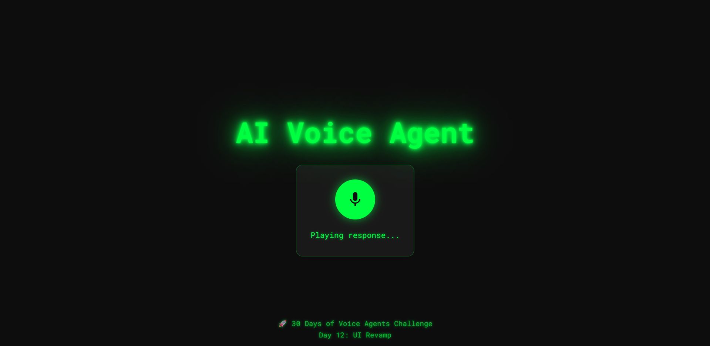

# 30 Days of AI Voice Agents

Welcome to the 30 Days of AI Voice Agents Challenge! This project is a hands-on journey through building a modern, conversational AI voice agent using FastAPI, Murf AI, AssemblyAI, and Google Gemini.



## 🚀 Project Overview
This app lets you talk to an AI agent using your voice. It transcribes your speech, sends it to a large language model (LLM) for a smart response, and then speaks the answer back to you using realistic TTS. The app remembers your conversation for a natural, context-aware experience.

## 🛠️ Technologies Used
- **FastAPI** (Python) — API server
- **AssemblyAI** — Speech-to-Text (STT)
- **Google Gemini** — Large Language Model (LLM)
- **Murf AI** — Text-to-Speech (TTS)
- **Vanilla JavaScript** — Frontend logic
- **HTML/CSS** — Modern, animated UI

## 🏗️ Architecture
```
[User Voice] → [Frontend JS] → [FastAPI Server]
    └─> [AssemblyAI STT]
    └─> [Google Gemini LLM]
    └─> [Murf AI TTS]
    └─> [Frontend: Audio Playback]
```
- **Session-based chat**: Each conversation is tracked by a session ID for context/memory.
- **Single record button**: Clean, animated UI for seamless voice interaction.
- **Error handling**: Fallback audio if any API fails.

## ✨ Features
- Voice-to-voice chat with memory
- Modern, animated UI (Day 12)
- Robust error handling (Day 11)
- Easy to run locally

## ⚙️ Setup & Running
1. **Clone the repo:**
   ```sh
   git clone <your-repo-url>
   cd murf-ai-30days
   ```
2. **Install dependencies:**
   ```sh
   pip install -r requirements.txt
   ```
3. **Set environment variables:**
   Create a `.env` file in the root with:
   ```env
   MURF_API_KEY=your_murf_api_key
   ASSEMBLYAI_API_KEY=your_assemblyai_api_key
   GEMINI_API_KEY=your_gemini_api_key
   ```
4. **Run the server:**
   ```sh
   uvicorn main:app --reload
   ```
5. **Open in browser:**
   Go to [http://localhost:8000](http://localhost:8000)

## 📦 API Endpoints
- `POST /agent/chat/{session_id}` — Main conversational endpoint (audio in, audio out)
- `POST /tts/generate` — Text-to-speech
- `POST /transcribe/file` — Audio transcription

## 📝 License
MIT

---
#BuildwithMurf #30DaysofVoiceAgents
